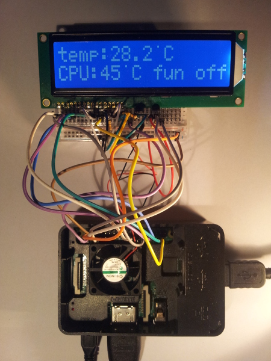

# Temperature control in Raspberry Pi

This system is designed for temperature control and avoiding overheating Raspberry Pi. 
The CPU Core temperature is controlled every 10 seconds by Linux command. After the temperature exceeds 45 celsius degree the fan starts spinning. System displays information about ambient and CPU Core temperature and whether the FAN is turn on/turn off.

The system consists of:
- Raspberry Pi 3
- LCD 2x16 ABC016002C
- FAN 5V
- Transistor BC 337-40
- Temperature Sensor DS18B20
- Resistor, wires, breadboard

